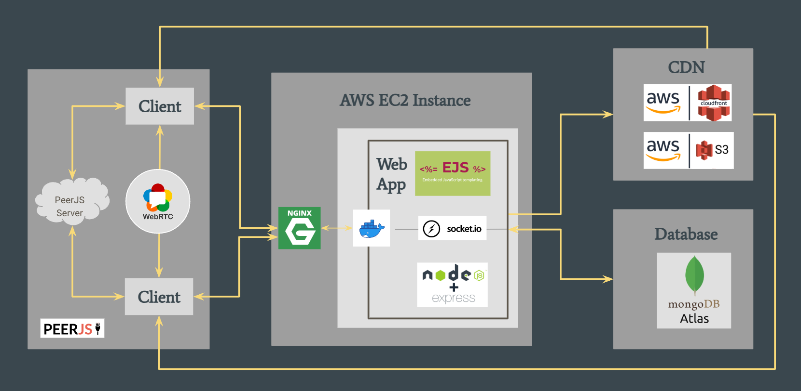
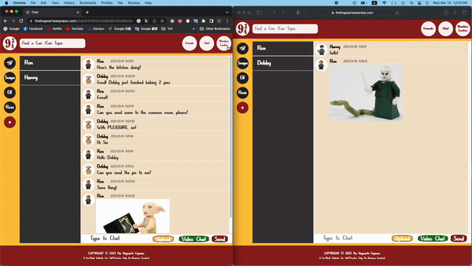

# The Hogwarts Express :steam_locomotive:
A chat website created with **Node.js**, **Socket.io** and **MongoDB** for Potterheads to (video) chat about their passion for the magical world.

## Table of Contents
* Get Started
* Technologies
* User Guideline
* Repository Structure

## Get Started
1. npm install
2. npm run

## Technologies

* Web App
    * Node.js
    * Socket.io
    * PeerJS
* Database
    * MongoDB Atlas
* CDN
    * AWS S3
    * AWS Cloudfront
* CI/CD
    * GitHub
    * Nginx
    * AWS EC2 Instance
    * Docker

## User Guideline
1. Create Account and Login<br>

2. Add Friend<br>

3. Direct (Video) Chat with Friends<br>


4. Find / Create a Car to Group Chat<br>


5. Select / Create a Compartment to Manage Sub-Topic Rooms<br>

<!-- 6. All Chat Data is User-Verified<br>

 -->

## Repository Structure
```bash
├── README.md
├── package.json
├── server.js
├── s3.js
├── Dockerfile
├── config
│   ├── config.js
│   └── db.js
├── models
│   ├── carsModel.js
│   ├── chatsModel.js
│   ├── compartmentsModel.js
│   ├── messagesModel.js
│   └── usersModel.js
├── views
│   ├── partials
│   │   ├── header.ejs
│   │   ├── setup.ejs
│   │   ├── sidebar.ejs
│   │   └── footer.ejs
│   ├── car.ejs
│   ├── chat.ejs
│   ├── floo.ejs
│   ├── friend.ejs
│   ├── index.ejs
│   ├── login.ejs
│   └── video.ejs
├── controllers
│   ├── authController.js
│   ├── carController.js
│   ├── chatController.js
│   ├── compartmentController.js
│   ├── friendController.js
│   ├── chatController.js
│   ├── messageController.js
│   └── userController.js
├── routes
│   └── indexRoute.js
└── public
    ├── images
    ├── scripts
    │   ├── car-common.js
    │   ├── car.js
    │   ├── chat-common.js
    │   ├── chat.js
    │   ├── floo.js
    │   ├── friend.js
    │   ├── index.js
    │   ├── login.js
    │   ├── navbar.js
    │   └── socket-common.js
    └── styles
```


